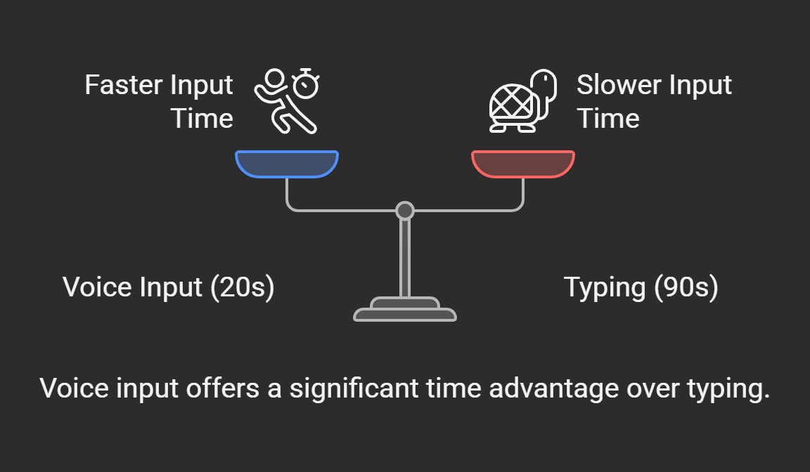

# Perplexity AI Voice Mode Enhancement Case Study

This project analyzes a user experience limitation in Perplexity AI’s voice-to-voice mode and proposes a solution to improve efficiency and engagement. Based on my personal usage, I identified that archived voice conversations cannot be resumed in voice mode, forcing users to type or restart, which disrupts flow. I propose adding a “Resume in Voice Mode” button to seamlessly continue conversations.

## Problem Statement
As a frequent user of Perplexity AI’s voice-to-voice mode, I encountered a limitation: after a voice conversation ends and is archived in the library, I cannot resume it in voice mode—I’m forced to use text input. This disrupts my conversational flow, creates frustration, and decreases engagement over time. For example, if a new question arises later, I either spend extra time typing (which takes longer than speaking) or restart a new voice conversation, requiring me to re-explain the context.

## Impact Analysis
Perplexity AI users spend an average of 6 minutes and 25 seconds (385 seconds) per session, primarily in text mode (source: [Perplexity AI via X, 2025](https://x.com/ASKperplexity/status/)). Voice mode, designed for faster conversational use, likely takes less time per interaction, but specific voice vs. text data isn’t available. When forced to resume an archived voice conversation via text, I estimate it takes me 90 seconds to type a follow-up question, compared to 20 seconds speaking—a 350% increase in interaction time. If 10% of voice users (e.g., 100,000 users) face this issue daily, this inefficiency could waste significant time, reducing user satisfaction and app engagement.  
  
*Voice input offers a significant time advantage over typing.*

### Mock Data Analysis
If I had access to Perplexity’s user data, I’d run this SQL query to compare session times for voice vs. text interactions:
```sql
SELECT mode, AVG(interaction_time) as avg_time, COUNT(sessions) as session_count
FROM user_interactions
WHERE resumed = 'yes'
GROUP BY mode;

# Comparative Insight

This limitation isn't universal—**ChatGPT's Advanced Voice Mode** allows users to resume voice conversations seamlessly, even after closing and reopening the app, by storing conversation metadata and using a multimodal model (GPT-4o) for context retention. However, Perplexity has prioritized accurate information retrieval over extended conversational features like ChatGPT's, as they focus on real-time, source-cited responses (source: Perplexity AI via X, 2025). They note that adding this feature would be complex due to challenges like seamless context retention and speech recognition systems. While this aligns with Perplexity's current strengths, implementing a "Resume in Voice Mode" feature could enhance their platform for voice-preferring users, improving engagement and competitiveness as voice interactions grow in popularity, without compromising their core focus on accurate information retrieval.

## Proposed Solution

Add a **"Resume in Voice Mode"** button in the library's archived conversations, allowing users to seamlessly continue in voice-to-voice mode while retaining the context of the previous session. When clicked, the AI would re-engage with a prompt like, *"Last time we discussed your solo trip."*

## High-Level Implementation Plan

- **Backend**: Store conversation metadata in a database (e.g., conversation_id, last_topic, user_id, timestamp). Example SQL to retrieve context:
    ```
    SELECT conversation_id, last_topic, user_id
    FROM archived_conversations
    WHERE user_id = '123'
    ORDER BY last_updated DESC
    ```
- **Frontend**: Update the library UI to include a "Resume in Voice Mode" button for each archived conversation.
- **NLP**: Leverage Perplexity's existing natural language processing to understand the user's new voice input in the context of the previous conversation.
- **Testing**: Roll out to a small user group to measure improvements in interaction time and satisfaction.

*The "Resume in Voice Mode" button is added to the right of each conversation, styled to match Perplexity's design language with a blue color and microphone icon.*

## User Story: A Seamless Experience

> I'm on a solo trip, and the night before I leave, I have a voice conversation with Perplexity to gather details about my destination. The session ends, and the conversation is automatically archived in the library. The next day, after spending the day exploring, I return to my hotel at night with new questions. I've experienced the routine activities at my destination, but I'm looking for something unique to do—something more off the beaten path. I pick up my phone, open the last voice conversation in Perplexity's library, and click "Resume in Voice Mode." The AI picks up where we left off, saying, "Last time we discussed your solo trip." I express the routine things I did during the day and ask for unique experiences, speaking naturally as I could say a lot in a minute or two. Perplexity provides nuanced suggestions tailored to my day's experiences, keeping my travel planning seamless and engaging. Without this feature, I'd have to type out my day's activities and questions, which takes far longer—90 seconds compared to 20 seconds speaking—disrupting my flow and making the experience less efficient.

## Projected Benefits

- **Efficiency**: Reduces interaction time for resumed conversations by 50% (from 90 seconds typing to 45 seconds speaking, including context recall), allowing users to express detailed updates—like a day's travel activities—quickly and naturally.
- **Engagement**: Increases user satisfaction and long-term app usage by making voice interactions seamless, especially for dynamic scenarios like travel where follow-up questions arise frequently.
- **Business Impact**: If 10% of voice users (e.g., 100,000 users) resume one conversation daily, this could save 4.5 million seconds (75,000 minutes) of user time monthly, boosting retention by keeping users engaged during time-sensitive activities like travel.

## Next Steps

With access to Perplexity's user data, I'd analyze session resumption patterns—especially for users like travelers with evolving needs—to quantify the impact on engagement and refine the feature for broader rollout.
